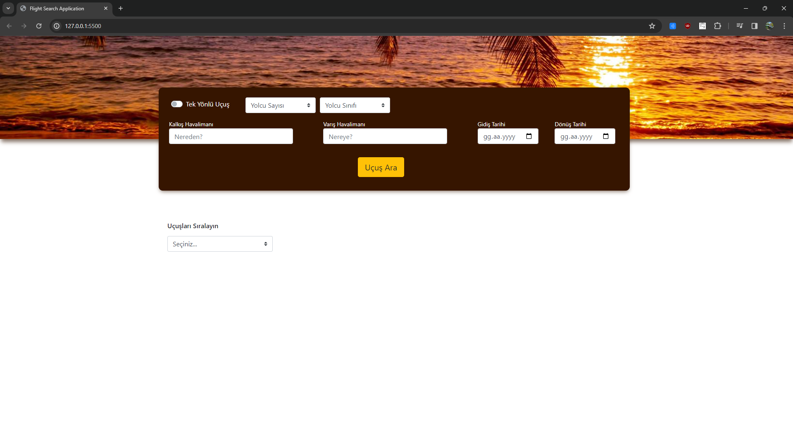
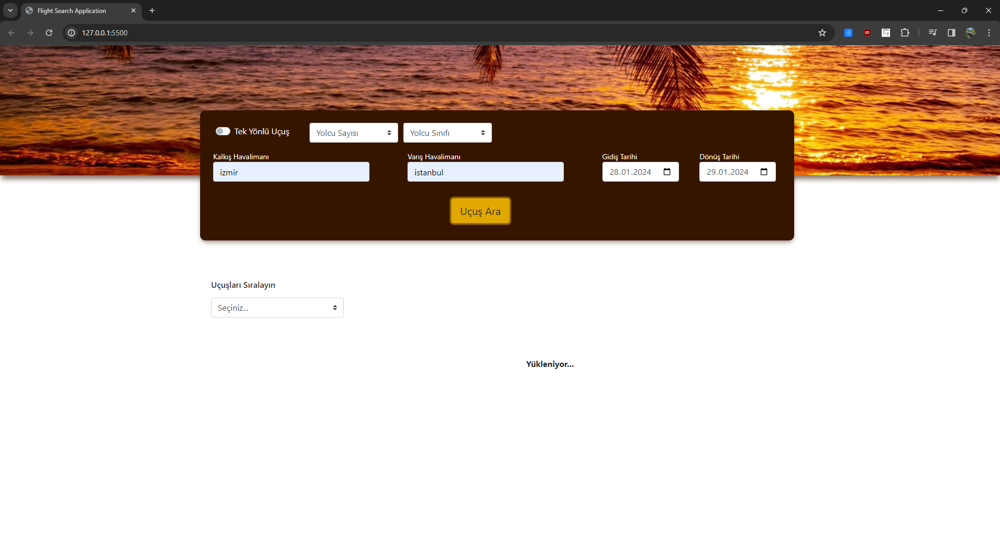
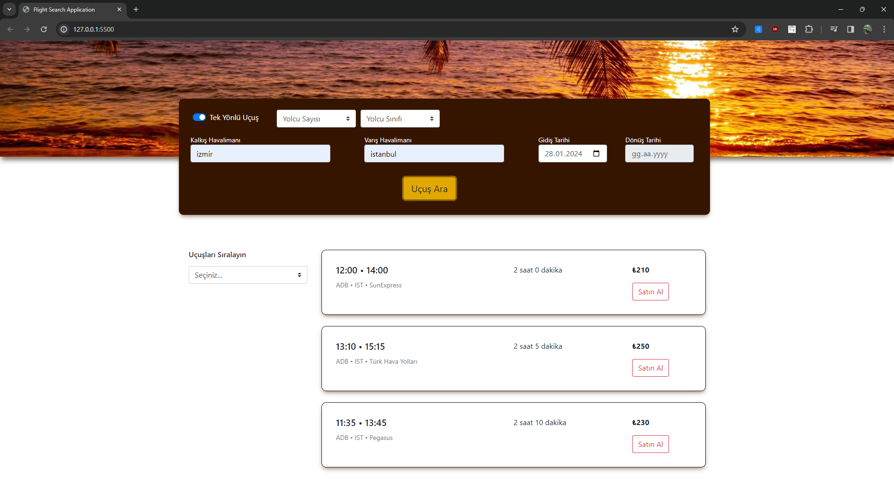
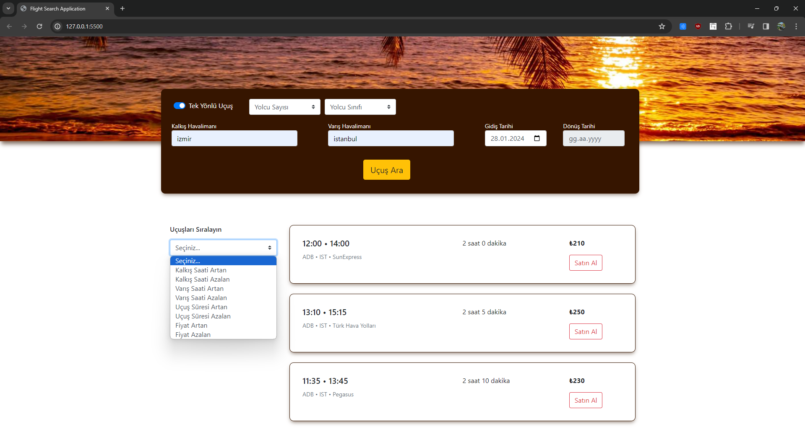
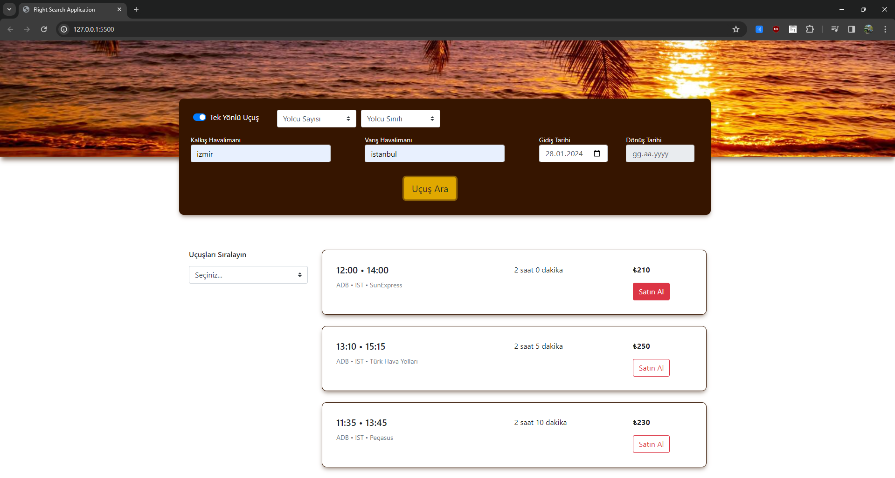
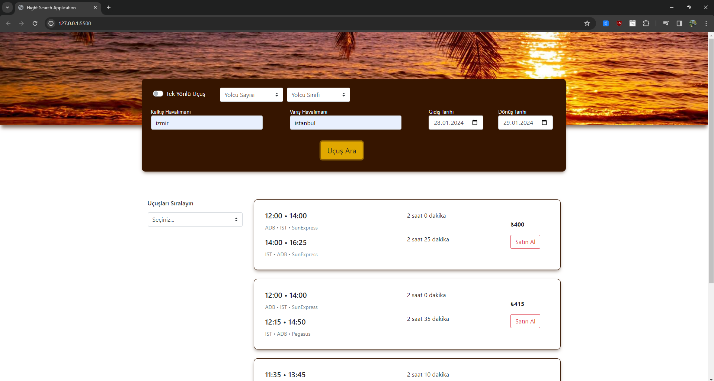
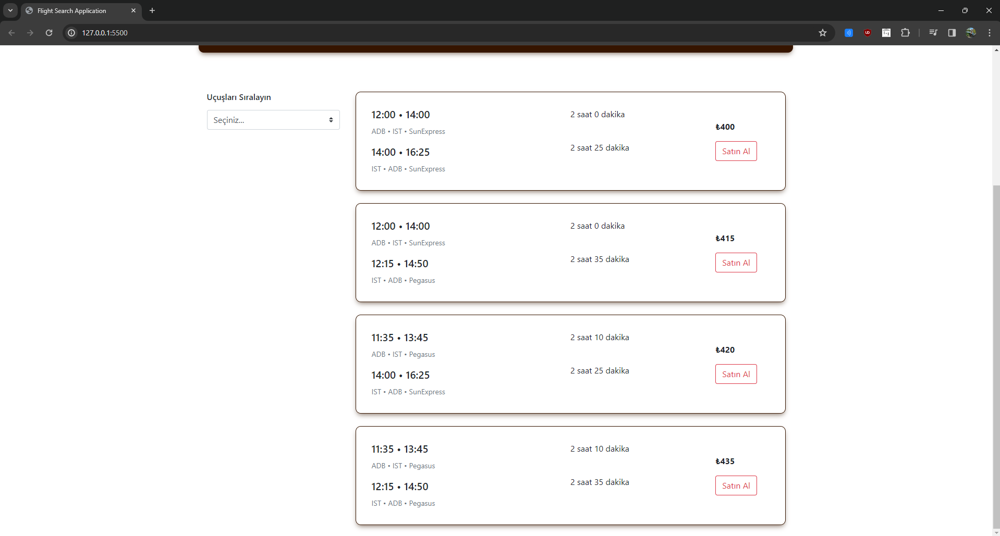

# Flight Search Website for Amadeus Interview

### Kullandığım Teknolojiler:

  
  
  
  
  

### Ana Sayfa
Sayfanın genel görünümü bu şekildedir.

### Yükleniyor Animasyonu (2000 milisaniye bekletiyor)
Kullanıcıyı 2000 milisaniye bekletiyor.

### Tek Yön Seçimi İle Çıkan Sonuçlar
Tek yön seçili iken dönüş tarihi kutucuğu disabled oluyor.

### Sıralama Seçenekleri

### Listelenen Uçuşlardaki Buton Özelliği
Normalde kırmızı çerçeveli focus durumunda tamamen kırmızı olan butonlar.

### Çift Yön Seçimi İle Çıkan Sonuçlar

